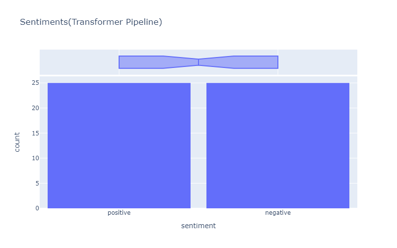
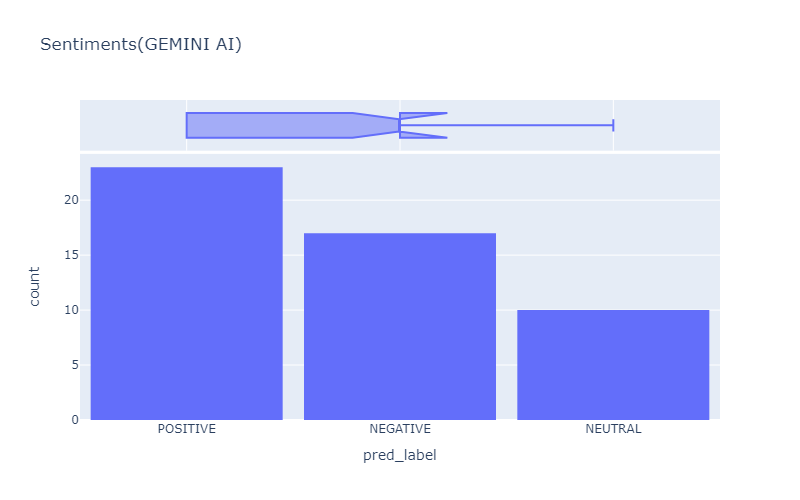

---

# Summary of Sentiment Analysis Project

## Objective:
The primary objective of this project is to perform sentiment analysis on a collection of text reviews using three different techniques:** VADER** (Valence Aware Dictionary and sEntiment Reasoner), **the Roberta Pretrained Model from Huggingface**, **Transformer pipeline** and **Gemini AI**.

## Techniques Used:

### VADER (Valence Aware Dictionary and sEntiment Reasoner):
- **VADER** is a lexicon and rule-based sentiment analysis tool specifically attuned to sentiments expressed in social media.
- It uses a "bag of words" approach where each word in the text is scored and combined to provide a final sentiment score. This approach considers the presence of stop words and other common language patterns to determine the sentiment polarity (negative, neutral, or positive).

### Roberta Pretrained Model:
- **Roberta** is a transformer-based model that has been trained on a large corpus of data. It accounts for the context of words in a sentence, making it a powerful tool for understanding the nuances of language.
- The **Huggingface Pipeline** is used to leverage this model for sentiment analysis, providing a more context-aware evaluation of text sentiment.

### Gemini AI:
- **Gemini AI** is another sophisticated tool for sentiment analysis, leveraging advanced machine learning techniques to analyze and classify sentiment in text data.
- Similar to Roberta, Gemini AI considers the contextual relationships between words to provide accurate sentiment scores.

## Steps Involved:

### 1. Data Preparation/Preprocessing:
- Load the dataset containing User reviews.
- Clean **Encoding** issues using ftfy library
- Utility function to clean text by removing **links**, **special characters** using simple **regex** statements.
- Preprocess the text by converting it to **lowercase** , to ensure consistency.
- Remove **HTML** tags, extra whitespaces, and trim leading and trailing spaces

### 2. VADER Sentiment Scoring:
- Utilize NLTK's SentimentIntensityAnalyzer to obtain sentiment scores (negative, neutral, and positive) for each review.
- The bag of words approach helps in assigning sentiment scores based on the lexical properties of the words in the text.

- Here you can infer that there are
- **Positive** = 19
- **Negative** = 9
- **Neutral** = 22

### 3. Roberta Sentiment Scoring:
- Apply the Roberta Pretrained Model to analyze the sentiment of each review.
- Model that was used here is MODEL = f'cardiffnlp/twitter-roberta-base-sentiment'
- Use the Huggingface Pipeline to get the sentiment probabilities (negative, neutral, positive) for each review.

- Here you can infer that there are
- **Positive** = 21
- **Negative** = 17
- **Neutral** = 12

### 3. Transformer Pipeline Scoring:
- The Transformer Pipeline is a powerful and flexible tool provided by the Huggingface library.
- which simplifies the application of pre-trained transformer models to various NLP tasks. 

- Here you can infer that there are
- **Positive** = 25
- **Negative** = 25

### 4. Gemini AI Sentiment Scoring:
- Use the Gemini AI model to analyze the sentiment of each review.
- Extract sentiment probabilities (negative, neutral, positive) from the model for each review.

- Here you can infer that there are
- **Positive** = 23
- **Negative** = 17
- **Neutral** = 10

### 6. Sentiment Classification:
- In the sentiment classification analysis, it was observed that **VADER** yielded subpar results, with a considerable number of reviews classified as *neutral*.
- Conversely, the **Transformer Pipeline**, though touted for its robustness, surprisingly underperformed in this context, displaying an equal distribution of *positive* and *negative* sentiments.
- However, when comparing the performance of **Gemini AI** and **RoBERTa**, a notable improvement was observed. - **Gemini AI** demonstrated a balanced distribution of sentiments, whereas **RoBERTa** showcased a slightly better performance, particularly in distinguishing *positive* and *negative* sentiments.
- This suggests that **Gemini AI** and **RoBERTa**, leveraging advanced NLP techniques, were better equipped to discern sentiment nuances in the reviews, leading to more accurate classification results.

## Results and Findings:
- The project provides a detailed comparison of sentiment analysis using traditional lexicon-based (VADER) and modern transformer-based (Roberta, Gemini AI) approaches.
- It highlights the strengths and weaknesses of each method in accurately capturing the sentiment of text reviews.
- The results can be used to understand the sentiment distribution in the dataset and to make informed decisions based on the sentiment analysis.

## Conclusion:
This project demonstrates the application of three powerful sentiment analysis techniques on a real-world dataset. By combining the simplicity of VADER, the contextual understanding of Roberta, and the advanced capabilities of Gemini AI, it provides a comprehensive approach to sentiment analysis, useful for various applications such as customer feedback analysis, social media monitoring, and more.

---
